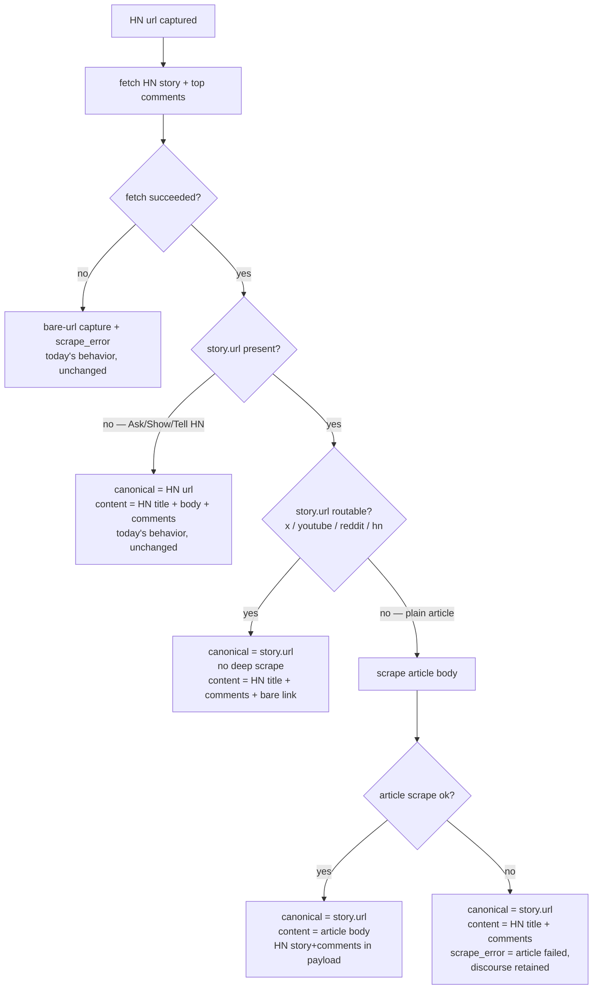

# HN Link Surfacing

## Summary

When a captured Hacker News story links out to an external article, the article becomes the capture's canonical link and (for plain articles) its scraped body. The HN story and top comments are retained as secondary discourse in the payload. Self-posts (Ask/Show/Tell HN with no outbound url) are unchanged.

---

## Problem Frame

The single user captures links via a Telegram bot. Today, pasting an HN story url produces a capture whose canonical url is `news.ycombinator.com/item?id=...` and whose body is the HN title plus the top ten comments. The external article HN points to is never scraped — it appears only as a bare `[link: ...]` string (`bot/ingest/hn.py:118`).

Six months later the archive reads as a list of HN permalinks, not the things of value behind them. The article was the point; the HN thread was the discovery surface and the expert commentary around it. The capture's most useful content (the article itself) is the one piece currently missing.

---

## Key Flows

- F1. HN-discovered article capture
  - **Trigger:** user sends an HN story url to the bot
  - **Steps:** fetch HN story + top comments → branch on `story.url` presence and `classify_url(story.url)` → set canonical url, scrape or skip, assemble content → retain HN discourse in payload
  - **Outcome:** capture canonical link points at the real destination; article body present when it was a plain article; HN discourse always preserved on success
  - **Covered by:** R1, R3, R4, R5, R6, R7

---

## Requirements

**Link selection & routing**
- R1. When the fetched HN story has an outbound `story.url`, the capture's canonical url is `story.url`, not the HN item url.
- R2. When `story.url` is absent (Ask/Show/Tell HN and other self-posts), behavior is unchanged from today: canonical url is the HN item url; content is the HN title, self-text, and top comments.
- R3. When `story.url` is present and classifies as a routable source (`x`, `youtube`, `reddit`, or `hn` per the existing `classify_url`), the canonical url is `story.url` but it is NOT deep-scraped. Content is the HN title plus top comments plus the bare outbound link.
- R4. When `story.url` is present and classifies as `generic` (a plain article), the article body is scraped with the same extraction robustness a directly-pasted article would receive. Canonical url is `story.url`; primary content is the article body.

**Discourse retention**
- R5. On any branch where the HN fetch succeeded (R1, R3, R4), the HN story metadata and top comments are retained in the capture payload as secondary discourse. They are never discarded in favor of the article.

**Failure handling**
- R6. When `story.url` is a plain article but the article scrape fails (paywall, dead link, extractor miss), the canonical url stays `story.url`, the content falls back to the already-fetched HN title plus top comments, and `scrape_error` records that article extraction failed while HN discourse was retained.
- R7. When the HN item fetch itself fails (Firebase API unavailable, bad id), behavior is unchanged from today: a bare-url capture with the existing `hn fetch failed` `scrape_error`.

**Provenance**
- R8. The `source` frontmatter field stays `hn` for every HN-discovered capture regardless of branch. The article-vs-discussion distinction lives in the payload, not in the `source` tag.

---

## Acceptance Examples

- AE1. **Covers R1, R4, R5.** Given an HN story whose `story.url` is a plain blog article, when captured, then the canonical url is the article url, the content is the scraped article body, and the HN story + top comments are present in the payload.
- AE2. **Covers R2.** Given an "Ask HN: ..." post with no `story.url`, when captured, then the canonical url is the HN item url and the content is the HN title, self-text, and top comments — identical to today.
- AE3. **Covers R3.** Given an HN story whose `story.url` is an `x.com` tweet, when captured, then the canonical url is the tweet url, the tweet is NOT scraped via nitter, and the content is the HN title + top comments + the bare tweet link.
- AE4. **Covers R6.** Given an HN story whose `story.url` is a paywalled article that fails extraction, when captured, then the canonical url is still the article url, the content is the HN title + top comments, and `scrape_error` notes the article failed but HN discourse was retained.
- AE5. **Covers R7.** Given an HN item id that the Firebase API cannot return, when captured, then the result is a bare-url capture with the existing `hn fetch failed` error — unchanged from today.
- AE6. **Covers R8.** Given any successful HN-discovered article capture, when the markdown is written, then the `source` frontmatter is `hn`.

---

## Success Criteria

- An HN-discovered article in the archive, re-read months later, opens to the article and carries the HN discussion alongside it — not an HN permalink with the article missing.
- A paywalled or dead article still yields a useful capture (the HN expert discussion) rather than an empty bare-url entry.
- `ce-plan` can implement the routing without inventing branch behavior, failure handling, or the `source`-tag decision — all are specified here.

---

## Scope Boundaries

- Reddit generalization (the "aggregator wraps a payload" pattern) is deferred. Reddit ingest captures no comments today (`bot/ingest/exa.py` returns a single text blob), so applying this pattern to Reddit is separate, larger work, not part of this change.
- Recursing routable targets through the router (e.g., HN → tweet producing a nitter-scraped tweet) is explicitly rejected. Routable targets get the bare link only (R3).
- No url-based deduplication is introduced. Dedup today is on `telegram_msg_id` only (verified, `bot/db.py:44`); flipping the canonical url does not create a merge/collision concern, and adding url dedup is out of scope.
- Adapting downstream digest/tweet/week consumers to the new content shape under `source=hn` is out of scope here (see Key Decisions and Outstanding Questions for the flagged consequence).

---

## Key Decisions

- Article-primary even for routable targets, but no recursion: the canonical link should point at the real destination regardless, but only plain articles justify a deep scrape. Keeps the change bounded and avoids re-entering the router.
- HN comments always retained as the failure fallback: a paywalled or dead article still yields the expert discussion, which is frequently the real value of an HN find.
- `source` stays `hn`: provenance ("I found this on HN") is itself signal, and keeping the tag stable means zero blast radius into the actively-evolving digest/tweet/week pipeline.
- No url dedup concern: verified that dedup is `telegram_msg_id`-only, so the dream's "flipped canonical url causes silent merge" risk does not exist in this codebase.

---

## Dependencies / Assumptions

- Reuses the existing `classify_url` (`bot/ingest/urls.py`) to decide routable-vs-generic for `story.url`. The routable set is exactly `{hn, x, youtube, reddit}`; everything else is `generic`.
- Reuses the existing generic-article extraction path (`generic.extract_article` with the Zyte fallback, `bot/ingest/router.py:162-194`) for R4 — "same robustness as a directly-pasted article" means literally that path, not a new one.
- `HnStory.url` is already populated from the HN Firebase API today (`bot/ingest/hn.py:99`); no new fetch is required to know the outbound url.
- Assumes the HN top-comment fetch cost (already paid today) is acceptable to keep paying on the article branches, since comments are now a fallback safety net, not just primary content.

---

## Outstanding Questions

### Deferred to Planning

- [Affects R4][Technical] How the HN branch invokes the article extractor — call the router's generic path directly, factor a shared article-extraction helper, or inline it. Implementation choice, settled during planning.
- [Affects R8][Needs research] Downstream behavior when a `source=hn` capture now carries a full article body instead of a short comment blob. The digest/tweet/week pipeline is mid-flight; planning should check whether any consumer branches on the assumption "hn = short comment blob" and whether that needs adjusting in or after this change.
