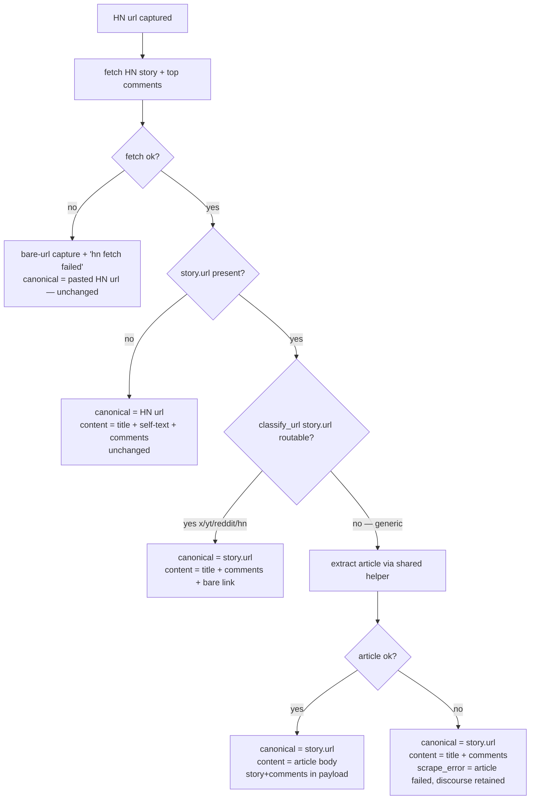

# feat: HN Link Surfacing — Article-Primary Captures with HN Discourse

## Summary

When a captured HN story links out, the router resolves the capture's canonical url to the outbound link, scrapes plain articles for their body, and retains the HN story + comments as secondary discourse. The work is concentrated in `bot/ingest/router.py` and `bot/ingest/hn.py`, with a small handler change to stop assuming the pasted url is the saved url.

---

## Problem Frame

Today an HN capture is saved with the HN permalink as its canonical url and a body of HN title + comments; the external article it points to is never scraped (`bot/ingest/hn.py:118` emits only a bare `[link: ...]`). The archive ends up a list of HN permalinks, missing the actual articles. Full motivation in origin (see Sources & References).

---

## Requirements

- R1. HN story with outbound `story.url` → capture canonical url is `story.url`, not the HN item url.
- R2. `story.url` absent (Ask/Show/Tell HN, self-posts) → unchanged: canonical = HN item url; content = HN title + self-text + comments.
- R3. `story.url` present and classifies as routable (`x`/`youtube`/`reddit`/`hn`) → canonical = `story.url`, no deep scrape; content = HN title + comments + bare link.
- R4. `story.url` present and classifies as `generic` → scrape the article body with the same robustness a directly-pasted article gets; canonical = `story.url`; primary content = article body.
- R5. On any branch where the HN fetch succeeded, HN story metadata + top comments are retained in the payload as secondary discourse — never discarded.
- R6. `story.url` generic but article scrape fails → canonical stays `story.url`; content falls back to the already-fetched HN title + comments; `scrape_error` records article failed, discourse retained.
- R7. HN item fetch itself fails → unchanged: bare-url capture with the existing `hn fetch failed` error.
- R8. `source` frontmatter stays `hn` for all HN-discovered captures regardless of branch.

**Origin flows:** F1 (HN-discovered article capture)
**Origin acceptance examples:** AE1 (R1,R4,R5), AE2 (R2), AE3 (R3), AE4 (R6), AE5 (R7), AE6 (R8)

---

## Scope Boundaries

- Reddit generalization (aggregator-wraps-payload) — deferred; Reddit captures no comments today, separate larger work (origin: Scope Boundaries).
- Recursing routable targets through the router (HN→tweet producing a nitter scrape) — explicitly rejected; routable targets get the bare link only (R3).
- No url-based deduplication introduced; dedup remains `telegram_msg_id`-only.
- No changes to downstream digest/tweet/week consumer *code* — but this holds only because U3 surfaces article `title`/`text` at top-level `payload["scrape"]` (Key Technical Decisions) so the existing `weekly.py:124` / `tweet_daily.py:627-630` shape-readers pick the article up unchanged. The discourse-only and Ask/Show/Tell HN paths remain transparent to them as before.

---

## Context & Research

### Relevant Code and Patterns

- `bot/ingest/router.py` — `scrape_url`; the `hn` branch (lines ~46-58) and the inline generic→Zyte article block (lines ~162-194). `UrlScrapeResult` dataclass (~29-35) is the source→handler contract.
- `bot/ingest/hn.py` — `fetch_story`, `to_processing_content` (current content assembly, line 118 is the bare-link behavior being replaced), `to_payload`.
- `bot/ingest/urls.py` — `classify_url`; the routable set is exactly `{hn, x, youtube, reddit}`, everything else `generic`. Reused for the R3/R4 split on `story.url`.
- `bot/handlers.py:403-464` — capture flow. `db.insert_capture(... url=url ...)` at line 421 saves the *pasted* url; `source = scrape.source` at 407; `scrape_title` extraction at 411-415 already special-cases HN's nested `story.title`; the capture-time "why?" task at 461-464 also uses the pasted `url`.
- `bot/markdown_out.py:166-171` — only reads `scrape_error`/`tweetable` from payload; archive body is processed content. Payload-shape changes do not affect archive rendering.
- Test pattern: `pytest`, flat `tests/`. Scraper/router/handler coverage lives in `tests/test_ingest_scrapers.py`, `tests/test_ingest_router_and_urls.py`, `tests/test_handlers_and_webhook.py`.

### Institutional Learnings

- None — `docs/solutions/` absent; no repo `AGENTS.md`/`CLAUDE.md`.

### External References

- None — internal change; HN Firebase API already integrated; strong local pattern (the router itself).

---

## Key Technical Decisions

- Resolve the canonical url in the router, surfaced via a new optional field `canonical_url: str | None = None` on the shared `UrlScrapeResult`. The handler uses `canonical_url` when present, else the pasted url. Rationale: the router is where source-specific knowledge lives; non-HN sources stay untouched (field stays `None`); avoids the handler re-parsing payload to re-derive a url the router already knows.
- Reuse article extraction by factoring the existing inline generic→Zyte block into a private helper in `router.py`, called by both the generic branch and the HN article branch. Rationale: "same robustness as a directly-pasted article" (R4) is literally that path; one helper keeps the two callers in lockstep. Behavior-preserving for the generic branch.
- **Article-primary HN captures expose the scraped article `title`/`text` at the top level of `payload["scrape"]`, mirroring the directly-pasted-article shape (`router.py:188-191`). HN story + comments stay nested under `story`/`comments` (R5).** Rationale: `bot/digest/weekly.py:124` and `bot/tweet_daily.py:627-630` build the weekly-digest body and daily-tweet voice corpus from top-level `payload["scrape"]["text"]`/`["title"]`. If the article only lands in the LLM `content` blob, the scraped article never reaches digest/tweet — the feature would scrape articles no downstream consumer sees. Surfacing them top-level also gives U4 a defined discriminator (article title present → article-primary) since R5 guarantees `story` is always present and cannot itself signal article-vs-discourse.
- HN content-assembly variants (full vs discourse-only) live as helpers in `hn.py`; the router orchestrates which branch calls which. Rationale: keeps `hn.py` focused on HN data shaping, router on routing.
- `source` is left as the existing `hn` value the router already returns — R8 needs no code change beyond not regressing it.

---

## Open Questions

### Resolved During Planning

- [Affects R4] How the HN branch invokes the article extractor → factor the existing `router.py` generic→Zyte block into a shared private helper; no new module.
- [Affects R8] Downstream impact of article-body content under `source=hn` → no consumer *branches* on `source=="hn"`, and `markdown_out` reads only `scrape_error`/`tweetable`. But `weekly.py:124` and `tweet_daily.py:627-630` read top-level `payload["scrape"]["text"]`/`["title"]` by shape — resolved by the top-level-article-fields decision in Key Technical Decisions, not deferred. Covered by U3's digest/tweet integration scenario.

### Deferred to Implementation

- Exact helper names and signatures for the article-extraction helper and the `hn.py` content variants — settled when touching the code.
- Exact `payload["scrape"]` key names for the top-level article `title`/`text` — the *placement* (top-level, mirroring `router.py:188-191`) is decided in Key Technical Decisions; only the literal key strings are settled against real code in U3.

---

## High-Level Technical Design

> *This illustrates the intended approach and is directional guidance for review, not implementation specification. The implementing agent should treat it as context, not code to reproduce.*

In every `C -->|yes|` branch the HN story + comments are written to the payload (R5).

---

## Implementation Units

### U1. Resolved-canonical-url seam

**Goal:** Let a scraper tell the handler which url to save, without changing behavior for any current source.

**Requirements:** R1 (enabling), R8 (preserved)

**Dependencies:** None

**Files:**
- Modify: `bot/ingest/router.py` (add optional resolved-url field to `UrlScrapeResult`, default `None`)
- Modify: `bot/handlers.py` (use the resolved url for `db.insert_capture` and the capture-time "why?" task; fall back to the pasted url)
- Test: `tests/test_handlers_and_webhook.py`, `tests/test_ingest_router_and_urls.py`

**Approach:**
- Add an optional field to `UrlScrapeResult` carrying the url to persist; `None` means "use the pasted url".
- Handler computes the effective url once and uses it for both the capture row and the "why?" task.
- All existing branches (x, youtube, reddit, generic article, hn-as-is) leave the field `None` → zero behavior change this unit.

**Patterns to follow:** Existing `UrlScrapeResult` construction sites in `router.py`; existing handler url usage at `bot/handlers.py:421` and `:461-464`.

**Test scenarios:**
- Happy path: a scrape result with the resolved-url field unset → capture saved with the pasted url (all current sources unaffected).
- Happy path: a scrape result with the resolved-url field set → capture row and "why?" task both use the resolved url.
- Edge case: resolved url set to the same value as the pasted url → single coherent url, no double-handling.
- Integration: end-to-end handler path for a non-HN article url is byte-for-byte unchanged (regression guard).

**Verification:** Non-HN captures show no diff in saved url or "why?" behavior; the new field is threaded through and consumed by the handler.

---

### U2. Extract shared article-extraction helper

**Goal:** Make the generic→Zyte article extraction callable from more than one branch, behavior-preserving.

**Requirements:** R4 (enabling)

**Dependencies:** None

**Files:**
- Modify: `bot/ingest/router.py` (extract the inline generic→Zyte block ~162-194 into a private helper; generic branch calls it)
- Test: `tests/test_ingest_router_and_urls.py`

**Approach:**
- Lift the existing generic-article logic (generic extract, raw-retry-via-Zyte, error capture) into one private helper returning the article result + error.
- The current generic branch becomes a thin caller of the helper.
- Pure refactor — no observable change to generic-article captures.

**Execution note:** Characterization-first — assert current generic-article behavior (success, raw-retry-to-Zyte, total failure) is unchanged before/after the extraction.

**Patterns to follow:** Existing generic branch control flow in `router.py:162-194`.

**Test scenarios:**
- Happy path: generic article extracts cleanly → same `UrlScrapeResult` as before the refactor.
- Edge case: thin/raw first extraction with Zyte configured → Zyte retry path still taken, same result.
- Error path: extraction throws and Zyte unavailable/also-fails → same `article extraction failed` shape as today.
- Integration: existing generic-article router tests pass unmodified.

**Verification:** Generic-article behavior identical pre/post; helper is the single source of article-extraction logic.

---

### U3. HN branch decision tree

**Goal:** Implement R1–R7 in the HN path: article-primary canonical url, article scrape for generic targets, HN discourse retained, fallbacks.

**Requirements:** R1, R2, R3, R4, R5, R6, R7

**Dependencies:** U1, U2

**Files:**
- Modify: `bot/ingest/router.py` (HN branch logic and `UrlScrapeResult` assembly)
- Modify: `bot/ingest/hn.py` (content-assembly helpers: discourse-only vs full; ensure story+comments always available for the payload)
- Test: `tests/test_ingest_router_and_urls.py`, `tests/test_ingest_scrapers.py`

**Approach:**
- After a successful `fetch_story`, branch on `story.url` presence then `classify_url(story.url)`:
  - absent → existing behavior (resolved url stays `None`, full HN content).
  - routable → resolved url = `story.url`; content = HN title + comments + bare link.
  - generic → call the U2 helper; on success: resolved url = `story.url`, content = article body, and the article `title`/`text` are written at the **top level of `payload["scrape"]`** (Key Technical Decisions) so `weekly.py`/`tweet_daily.py` shape-readers pick them up; on failure: resolved url = `story.url`, content = HN title + comments, `scrape_error` set noting article failed but discourse retained, no top-level article fields.
- HN item fetch failure path unchanged (resolved url stays `None`, existing `hn fetch failed`).
- Payload always carries HN story + comments nested under `story`/`comments` on any successful fetch (R5), independent of which content variant was chosen; the top-level article fields are additive and present only on the generic-success branch.

**Technical design:** See High-Level Technical Design flowchart — directional, not a spec.

**Patterns to follow:** Existing `hn` branch and `hn.to_payload`/`to_processing_content` in `bot/ingest/hn.py`; `classify_url` usage in `router.py`.

**Test scenarios:**
- Covers AE1. Happy path: generic article target → resolved url = article url, content = scraped article body, payload contains HN story + top comments (nested) AND article `title`/`text` at top-level `payload["scrape"]`.
- Integration: an article-primary HN capture's payload satisfies the `weekly.py:124` / `tweet_daily.py:627-630` top-level `scrape["text"]`/`["title"]` shape — i.e., the scraped article reaches the digest body and tweet-voice corpus, same as a directly-pasted article. Discourse-only / scrape-fail / Ask HN payloads do NOT carry top-level article fields.
- Covers AE2. Edge case: `story.url` absent (Ask HN) → resolved url unset, content = HN title + self-text + comments (unchanged).
- Covers AE3. Edge case: `story.url` is an `x.com` url → resolved url = tweet url, no nitter scrape, content = HN title + comments + bare link.
- Covers AE3. Edge case: `story.url` is youtube / reddit / another HN url → same routable treatment as the x.com case.
- Covers AE4. Error path: generic article extraction fails → resolved url = article url, content = HN title + comments, `scrape_error` notes article failed + discourse retained.
- Covers AE5. Error path: `fetch_story` returns None → existing bare-url + `hn fetch failed` result, unchanged.
- Edge case: successful fetch with empty comment list → payload still well-formed, no crash, discourse section simply empty.
- Integration: R5 holds across every successful branch — story + comments present in payload whether content is article body, discourse-only, or full.

**Verification:** Each origin AE1–AE5 path produces the specified canonical url, content, payload, and `scrape_error`.

---

### U4. Handler title selection for article-primary HN captures

**Goal:** When an HN-discovered article is scraped, the capture title and "why?" prompt use the article title, not the HN story title.

**Requirements:** R4 (supporting), R8

**Dependencies:** U3

**Files:**
- Modify: `bot/handlers.py` (`scrape_title` extraction at ~411-415 to prefer the article title when the HN branch produced one, fall back to HN `story.title`)
- Test: `tests/test_handlers_and_webhook.py`

**Approach:**
- Discriminator is the **top-level article title in `payload["scrape"]`** (set only on U3's generic-success branch): present → article-primary, use the article title; absent → fall back to HN `story.title`. This works because R5 keeps `story` present on every successful fetch, so `story` itself cannot signal article-vs-discourse — the top-level article field is the only reliable signal.
- Confirm `source` remains `hn` end-to-end (R8) — assertion only, no logic change expected.

**Patterns to follow:** Existing `scrape_title` precedence logic at `bot/handlers.py:411-415`.

**Test scenarios:**
- Covers AE1. Happy path: HN-discovered article capture → `scrape_title` is the article title; "why?" prompt receives the article title.
- Covers AE6. Happy path: any successful HN-discovered article capture → saved `source` frontmatter is `hn`.
- Edge case: discourse-only HN capture (routable target / scrape-fail fallback) → title falls back to HN `story.title`.
- Edge case: Ask HN (no `story.url`) → title is the HN story title (unchanged).

**Verification:** Article-primary captures titled by article; HN-primary captures titled by HN story; `source` stays `hn` in all cases.

---

## System-Wide Impact

- **Interaction graph:** `UrlScrapeResult` is consumed only by `bot/handlers.py`. The new optional field touches that single consumer; all non-HN scraper branches pass it through as `None`.
- **Error propagation:** Article-extraction failure inside the HN branch must not raise — it degrades to the HN-discourse fallback (R6). HN-fetch failure keeps today's bare-url contract (R7).
- **State lifecycle risks:** None new — no schema change, no dedup change (`telegram_msg_id`-only retained).
- **API surface parity:** Other sources (x, youtube, reddit, generic) deliberately keep pasted-url-as-canonical; only HN opts into the resolved-url field. This asymmetry is intentional and documented in Key Technical Decisions.
- **Integration coverage:** R5 (discourse always retained on success) and the non-HN regression guard (U1) are the cross-layer behaviors unit mocks alone won't prove — both have explicit integration scenarios.
- **Unchanged invariants:** Ask/Show/Tell HN behavior (R2), HN-fetch-failure behavior (R7), generic-article behavior (U2 characterization), downstream digest/tweet/week (verified untouched), archive markdown rendering.

---

## Risks & Dependencies

| Risk | Mitigation |
|------|------------|
| U2 refactor silently changes generic-article behavior | Characterization tests asserting pre/post parity (U2 execution note) before any HN wiring. |
| Article scrape failure inside HN branch raises and breaks the capture | R6 fallback path explicitly tested (U3 AE4 scenario); HN branch must never propagate the article error. |
| Scraped HN article never reaches weekly digest / daily-tweet because they read top-level `payload["scrape"]["text"]`/`["title"]` and HN's `to_payload` nests under `story` | U3 surfaces article `title`/`text` top-level (Key Technical Decisions); U3 integration scenario asserts the `weekly.py`/`tweet_daily.py` shape is satisfied. |
| `source=hn` carries article-shaped content and a downstream consumer regresses | No consumer branches on `source=hn`; U4 adds an explicit `source=hn` assertion. |
| Article scrape error propagates and breaks the HN capture | U3 must wrap the U2 helper call so any exception degrades to the R6 discourse fallback; add an explicit test where the helper raises (not just returns failure) and the capture still lands. |
| U1's shared-field change leaks into non-HN sources | U1 ships behavior-neutral with a non-HN end-to-end regression scenario before U3 sets the field. |

---

## Sources & References

- **Origin document:** [docs/brainstorms/hn-link-surfacing-requirements.md](docs/brainstorms/hn-link-surfacing-requirements.md)
- Related code: `bot/ingest/router.py`, `bot/ingest/hn.py`, `bot/ingest/urls.py`, `bot/handlers.py:403-464`, `bot/markdown_out.py:166-171`
- Test surfaces: `tests/test_ingest_router_and_urls.py`, `tests/test_ingest_scrapers.py`, `tests/test_handlers_and_webhook.py`
